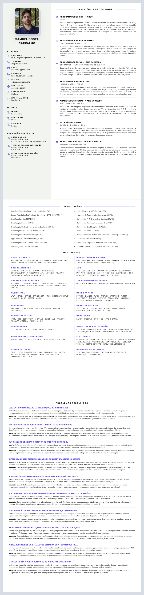

### kids-jobs

> Uma stack local-first para capturar vagas, operar scrapings, revisar oportunidades e manter um currículo pronto para envio, tudo sem depender da infraestrutura do HUNT.

`kids-jobs` é a extração standalone da vertical de empregos do workspace HUNT. O produto na interface aparece como `Jobs`, mas o repositório continua `kids-jobs` para preservar o contexto de origem.

Se você está chegando agora no projeto, a ideia central é simples: rodar tudo localmente, ter o banco na sua máquina, entender o fluxo inteiro de ponta a ponta e evoluir o produto sem carregar autenticação, filas externas, busca distribuída ou integrações corporativas desnecessárias.

#### O que a aplicação entrega hoje

##### 1. Dashboard operacional em `/`

A home não é uma landing page; ela é uma central de operação.

Ela reúne:

- métricas de vagas persistidas
- volume extraído por dia
- saúde local do backend e do stack de scraping
- últimas vagas capturadas
- execuções recentes
- fontes monitoradas
- ações rápidas para abrir vagas, editar currículo, enviar currículo, gerenciar fontes e rodar scrapings

É a tela para entender se o pipeline está vivo e se o acervo local está útil.

##### 2. Central de vagas em `/vagas`

A tela de vagas foi pensada como workflow real de triagem, não só como tabela.

Ela oferece:

- listagem densa de cards
- painel lateral de filtros
- detalhamento separado da vaga selecionada
- scroll interno independente para lista e detalhe, sem criar scroll geral da página
- filtros por texto, fonte, estado, contrato, senioridade, moeda, contato e faixa salarial
- ações rápidas por card, exibidas apenas em hover ou quando a vaga está marcada
- reprocessamento de vagas
- exclusão individual e em lote
- visualização de anexos, links, imagens, vídeos e atributos estruturados
- cópia do JSON da vaga para inspeção

É a tela para caçar oportunidades de forma operacional, com leitura rápida e contexto suficiente para decidir.

##### 3. Editor de currículo em `/resume`

O currículo é um produto dentro do produto.

Hoje ele suporta:

- persistência local no backend e fallback no `localStorage`
- edição por cards tradicionais
- edição inline direto no preview
- modo padrão com edição oculta para focar no resultado final
- alternância rápida entre mostrar e esconder painéis de edição
- preview visual separado do export
- importação de JSON
- cópia do JSON atual
- salvamento manual
- exportação para PDF
- envio por e-mail com PDF gerado no backend
- versão em `PT` e `EN`
- upload de foto
- presets de aparência
- troca de cor de destaque, lateral e página
- ajuste de escala tipográfica
- ajuste de largura da sidebar
- estilos de moldura da foto
- toggle para skills em maiúsculas
- reordenação por drag and drop em várias seções

Seções suportadas:

- dados principais do perfil
- idiomas
- formação acadêmica
- experiência profissional
- certificações
- grupos de habilidades
- problemas resolvidos

No preview da tela principal, os títulos das seções listáveis também funcionam como ponto de adição de novos itens.

Preview atual do currículo:



##### 4. Catálogo de fontes em `/sources`

`/sources` é a visão mais limpa de catálogo.

Ela existe para:

- filtrar fontes por nome ou cron
- paginar o catálogo
- ordenar por ID, nome, cron e status
- consultar rapidamente base URL, cron e status das fontes cadastradas

É a tela mais simples para governança e leitura rápida.

##### 5. Operação de scrapings em `/scrapings`

`/scrapings` é a tela operacional.

Ela concentra:

- criação de scraping
- edição de scraping
- ativação e desativação
- exclusão
- execução manual por fonte
- execução manual em lote
- edição de análise/observações da fonte
- paginação compacta
- busca full text
- filtro por status
- leitura de última execução
- leitura da próxima execução agendada

Em resumo:

- `/sources` = visão de catálogo
- `/scrapings` = visão de operação

#### Por que esse projeto vale a pena para novos devs

Porque ele tem um equilíbrio raro:

- simples de subir localmente
- útil de verdade no dia a dia
- arquitetura suficientemente séria para evoluir
- sem dependência de infraestrutura pesada

Na prática, ele já resolve um problema real:

- captura vagas
- organiza o acervo
- mantém histórico de execução
- permite reprocessar itens
- gera currículo em PDF
- envia currículo por e-mail

Tudo isso com:

- `FastAPI`
- `SQLite`
- `APScheduler`
- `Playwright`
- `Next.js`

Você consegue entender o sistema inteiro sem passar por cinco repositórios, oito serviços e três brokers.

#### Arquitetura

##### Princípios

- projeto totalmente separado de `hunt-*`
- domínio ativo apenas em `jobs`
- backend monolítico local
- frontend sem autenticação
- banco único local em SQLite
- scheduler local para automações de scraping e reprocessamento
- nada de RabbitMQ, Redis, OpenSearch, CPF/CNPJ ou integrações do ecossistema original

##### Stack

- Frontend: `Next.js 15`, `React 19`, `Tailwind CSS 4`, `Radix UI`, `Recharts`, `Sonner`, `Dnd Kit`
- Backend: `FastAPI`, `SQLAlchemy`, `APScheduler`, `Playwright`, `Pydantic Settings`
- Banco: `SQLite`
- Scraping: HTTP, anti-bot, browser e integração com Telegram onde configurado
- PDF: renderização do `/resume/export` via `Playwright`
- E-mail: `Resend`, quando configurado

##### Organização do código

```text
kids-jobs/
├── agents.md
├── docker-compose.yml
├── backend/
│   ├── adapters/
│   ├── application/
│   ├── configuration/
│   ├── scripts/
│   ├── tests/
│   └── main.py
└── frontend/
    ├── src/app/(dashboard)/
    │   ├── page.tsx
    │   ├── vagas/
    │   ├── resume/
    │   ├── sources/
    │   └── scrapings/
    ├── src/components/
    └── src/lib/
```

O backend segue uma divisão de `adapters`, `application`, `domain` e `ports`, mas continua fácil de navegar porque tudo está no mesmo deploy local.

#### Escopo funcional atual

##### Backend

- seed automático das fontes de jobs no startup
- scheduler local de scrapings
- histórico de execução por fonte
- fila local de reprocessamento (`rescrape_jobs`)
- CRUD de vagas
- filtros avançados em `/market`
- geração server-side de PDF do currículo
- envio de currículo por e-mail
- healthcheck, swagger e métricas Prometheus

##### Frontend

- dashboard jobs-only em `/`
- central de vagas em `/vagas`
- editor de currículo em `/resume`
- catálogo de fontes em `/sources`
- operação de scrapings em `/scrapings`
- redirects centralizados para rotas herdadas fora do escopo
- sem login
- sem middleware de autenticação

#### Rotas válidas da interface

- `/`
- `/vagas`
- `/resume`
- `/sources`
- `/scrapings`

Rotas herdadas como `/login`, `/categories`, `/market`, `/cpf`, `/agronegocio` e outras são redirecionadas para `/vagas` via `frontend/next.config.ts`.

#### Endpoints úteis

##### Backend

- `GET /health`
- `GET /swagger`
- `GET /swagger.yml`
- `GET /metrics`

##### Vagas

- `GET /market`
- `GET /market/count`
- `POST /market/lookup`
- `DELETE /market/{id}`
- `POST /market/delete-batch`

##### Fontes e scrapings

- `GET /api/v1/sources`
- `POST /api/v1/sources`
- `PUT /api/v1/sources/{id}`
- `PATCH /api/v1/sources/{id}/toggle`
- `PATCH /api/v1/sources/{id}/analysis`
- `DELETE /api/v1/sources/{id}`
- `GET /api/v1/scrapers/config`
- `POST /api/v1/scrapers/{source_id}/run`
- `POST /api/v1/scrapers/run-all`
- `GET /api/v1/source-executions`

##### Reprocessamento

- `POST /api/v1/rescrape-jobs`
- `GET /api/v1/rescrape-jobs`
- `POST /api/v1/rescrape-jobs/process`

##### Currículo

- `GET /api/v1/resume-document/`
- `PUT /api/v1/resume-document/`
- `POST /api/v1/resume-document/send-email`

#### Banco local

O banco padrão é SQLite:

- URL padrão: `sqlite:///./kids-jobs.db`
- arquivo local padrão: `backend/kids-jobs.db`

Tabelas relevantes:

- `jobs`
- `resume_documents`
- `sources`
- `rescrape_jobs`
- `source_execution_history`
- `telegram_offsets`

Se você quiser abrir no DBeaver, o formato JDBC é:

```text
jdbc:sqlite:/caminho/absoluto/para/kids-jobs/backend/kids-jobs.db
```

#### Scrapers ativos no seed de jobs

- `bne`
- `catho`
- `infojobs`
- `nerdin`
- `remotar`
- `remoteok`
- `spassu`
- `telegram_jobs_ti`
- `tractian`
- `vanhack`
- `wellfound`
- `weworkremotely`

Observação importante: o repositório ainda pode conter implementações compartilhadas de outras verticais, mas a operação deste projeto é jobs-only. O seed e o fluxo ativo devem continuar limitados a `jobs`.

#### Como rodar localmente

##### Requisitos

- `Python 3.11+`
- `Node.js 20+`
- `npm`
- navegadores do `Playwright` instalados no ambiente do backend

##### 1. Configure os arquivos de ambiente

Backend:

```bash
cp backend/.env.example backend/.env
```

Frontend:

```bash
cp frontend/.env.example frontend/.env.local
```

##### 2. Suba o backend

```bash
cd backend
python3 -m venv .venv
source .venv/bin/activate
pip install -r requirements.txt
python -m playwright install chromium
python main.py
```

##### 3. Suba o frontend

```bash
cd frontend
npm ci
npm run dev
```

##### URLs padrão

- Frontend: [http://localhost:3000](http://localhost:3000)
- Backend: [http://localhost:8001](http://localhost:8001)
- Healthcheck: [http://localhost:8001/health](http://localhost:8001/health)
- Swagger: [http://localhost:8001/swagger](http://localhost:8001/swagger)
- Metrics: [http://localhost:8001/metrics](http://localhost:8001/metrics)

#### Rodando com Docker

```bash
docker compose up --build
```

No `docker-compose.yml`:

- o backend sobe em `8001`
- o frontend sobe em `3000`
- o SQLite fica persistido no volume `kids_jobs_storage`

#### Variáveis de ambiente

##### Backend (`backend/.env`)

Principais variáveis:

- `DATABASE_URL`
- `PORT`
- `FRONTEND_APP_URL`
- `SCRAPING_SEED_ON_STARTUP`
- `SCRAPING_PROXY_POOL`
- `SCRAPING_TELEGRAM_API_ID`
- `SCRAPING_TELEGRAM_API_HASH`
- `SCRAPING_TELEGRAM_SESSION_STRING`
- `SCRAPING_TELEGRAM_JOBS_TI_CHANNELS`
- `SCRAPING_TELEGRAM_OCR_ENABLED`
- `SCRAPING_TELEGRAM_OCR_LANGUAGES`
- `SCRAPING_TELEGRAM_LOOKBACK_LIMIT`
- `RESCRAPE_QUEUE_BATCH_SIZE`
- `RESCRAPE_QUEUE_SCHEDULE_SECONDS`
- `RESEND_API_KEY`
- `RESEND_FROM_EMAIL`
- `RESEND_FROM_NAME`
- `RESEND_PERSONAL_FROM_EMAIL`
- `RESEND_PERSONAL_FROM_NAME`
- `RESEND_COMPANY_REPLY_TO_EMAIL`
- `RESEND_PERSONAL_REPLY_TO_EMAIL`

##### Frontend (`frontend/.env.local`)

- `NEXT_PUBLIC_API_URL`
- `NEXT_PUBLIC_SCRAPING_API_URL`

##### Se você mudar as portas

Alinhe estes valores juntos:

- `backend/.env` → `PORT`
- `backend/.env` → `FRONTEND_APP_URL`
- `frontend/.env.local` → `NEXT_PUBLIC_API_URL`
- `frontend/.env.local` → `NEXT_PUBLIC_SCRAPING_API_URL`

Isso é especialmente importante porque o PDF do currículo é gerado no backend renderizando o frontend em `/resume/export` via Playwright.

#### Fluxos principais

##### Captura e persistência de vagas

1. uma fonte é carregada pelo registry
2. o scraping é executado manualmente ou por agendamento
3. os itens são normalizados no contrato de `ScrapedItem`
4. o `MarketService` persiste o resultado em `jobs`
5. a dashboard e a tela de vagas passam a refletir o novo acervo

##### Reprocessamento

1. a vaga é enfileirada em `rescrape_jobs`
2. o processador local consome a fila em lote
3. a URL canônica é processada novamente com `scrape_url(url)`
4. o item é atualizado ou reinserido no acervo local

##### Currículo em PDF e e-mail

1. o draft é salvo como documento
2. o backend abre `/resume/export`
3. o payload é semeado no `localStorage`
4. o Playwright renderiza a página em modo print
5. o PDF é gerado
6. se configurado, o arquivo segue anexado no envio via Resend

#### Qualidade e desenvolvimento

##### Frontend

```bash
cd frontend
npm run lint
npm run build
```

##### Backend

```bash
cd backend
pytest
```

Há testes unitários e smoke tests em `backend/tests`, além de scripts auxiliares em `backend/scripts`.

#### Convenções importantes do projeto

- preserve o isolamento do `kids-jobs`
- não reintroduza integrações do HUNT por conveniência
- novos scrapers devem ser da vertical `jobs`
- mudanças de fluxo, contrato ou operação devem atualizar `agents.md` e este `README.md`
- a aplicação deve continuar útil para uso pessoal, local e sem atrito

#### Onde faz mais sentido começar como novo dev

Se você quer entender o sistema rápido:

1. suba backend e frontend
2. abra `/`
3. abra `/vagas`
4. rode um scraping manual em `/scrapings`
5. acompanhe o histórico no dashboard
6. abra `/resume` e gere um PDF

Esse caminho mostra quase tudo que o produto faz sem precisar ler o código inteiro primeiro.

#### Resumo

`kids-jobs` é um produto pequeno no tamanho da infra e grande no valor operacional.

Ele junta:

- coleta de vagas
- operação de fontes
- histórico de execuções
- reprocessamento local
- editor de currículo
- geração de PDF
- envio por e-mail

Tudo isso em uma base única, legível e evoluível por qualquer dev que queira trabalhar num sistema prático, direto e sem peso arquitetural desnecessário.
